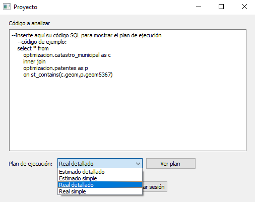

# Proyecto2-BD2

## Acerca de
* Visor de planes de ejecución: estimado o real, simple o detallado.
* Visor de privilegios de tablas y sus columnas.
* Motor de base de datos utilizado: PostgreSQL.
* Interfaz gráfica: PyQt5.
* Librería de conexión a base de datos: psycopg2.

## Login

## Visor de planes de ejecución

## Plan de ejecución

## Apartado de privilegios

## Integrantes:
* [Jairo Pacheco Campos](https://github.com/JairoPacheco)
* [Francisco Soto Quesada](https://github.com/franrsq)
* [Sebastián Rojas Vargas](https://github.com/SebastianRV26)

Curso: Bases de Datos 2. 
II Semestre 2020. 
Profesor: Leonardo Víquez Acuña.